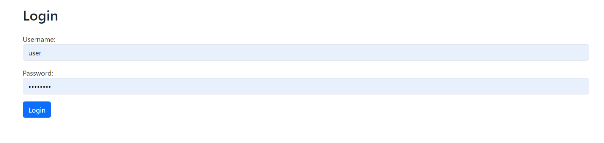

# Weather Application

This is the job interview task for software developer position

## What to do
* Fork the repository
* After work is done, make a pull request and notify me by email

## Task description
You need to use the Weather API provided here https://open-meteo.com/en to make the weather application. 
1. Call the API to get the locations by city name. Make the paging available with 10 items per page and a filter to filter by location name.
2. When clicked on the location it should show the weather forecast for the location with the temperature, surface wind and rain hourly. The interface should let you first see the daily forecast and when clicked it then should show the forecast hourly for the day you selected.
3. If you UI contains a chart it is a bonus. The interface should be convenient for user and rely on best usability and design practises
4. Only logged on users should be able to see the weather forecasts.
5. User should be able to mark the location favourite and have the favourite location list for quick access.

All the other specific requirements are up to you

## Technical requirements
* Use  Vaadin (https://vaadin.com/) framework for the frontend. For chart you may use some different framework
* For backend use Java EE
* Use any database (Postgres, Oracle, etc.)
* Make a Maven project

## Main points
* Structure your code
* Use best practises
* Use naming conventions
* Show understanding of software development concepts

### User Manual
# 1. Login
Description
The login page is where users can enter their credentials to access the WeatherApp.

Steps
Open the WeatherApp.
Enter your username =user and password = user@123.
Click the "Login" button to access the application.
Image 

2. Locations List with Search
Description
The Locations List page displays a list of locations by default "dhaka". Users can search for specific locations using the search bar.

Steps
Navigate to the "Locations" page from the main menu.
Use the search bar at the top of the page to search for a specific location.
Click on the location name to view detailed weather information.

3. Details of Location for 16 Days Weather
Description
The Details page provides 16-day weather forecasts including temperature, rain, wind, sunrise, and sunset for the selected location.

Steps
From the Locations List, click on a location name.
The Details page will display the weather forecast for the next 16 days.
View the temperature, rain, and wind information along with sunrise and sunset times for each day.
Image

4. Details of Location for a Day of Hourly Weather
Description
The Hourly Details page provides hourly weather information for a selected day including temperature, rain, and wind.

Steps
From the 16 Days Weather Details page, click on the desired date.
The Hourly Details page will display the hourly weather forecast for the selected day.
View the temperature, rain, and wind information for each hour of the day.

5. Logout
Description
The logout option allows users to securely log out of the WeatherApp.

Steps
Click on the "Logout" button located at the right side of the navigation menu.
You will be redirected to the login page.
Image