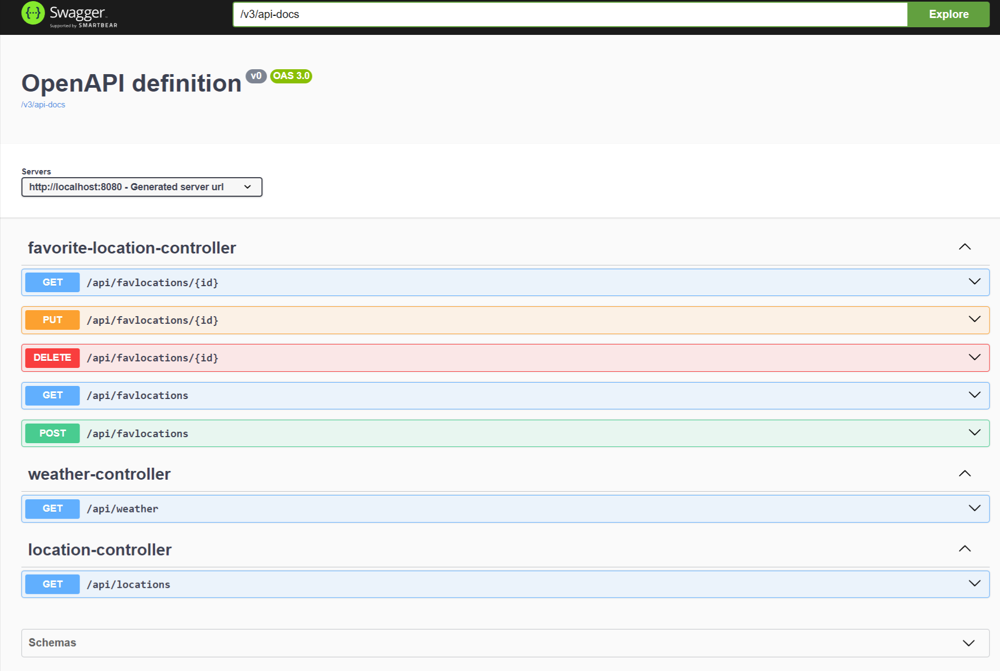

# Spring Boot Weather API

## Description
This Spring Boot project provides a RESTful API to manage weather data and favorite locations.

## Features
- Locations Api:
    use "https://geocoding-api.open-meteo.com/v1/" for location searcher
-Weather Api:
    use "https://api.open-meteo.com/v1/forecast" for days and hourly weather details
- CRUD operations for favorite locations
- Custom exception handling
- Integration with Angular frontend

## Prerequisites
- Java 17 or later
- Maven
- postgresql database =proitweather and schema = weather
- replace postgresql user and password in application.properties

# Development Tools
- Eclipse

## Installation

1. Clone the repository:
    ```bash
    git clone https://github.com/anseri/WeatherApp.git
    ```

2. Navigate to the project directory:
    ```bash
    cd pro-weather-server
    ```

3. Build the project:
    ```bash
    mvn clean install
    or windows
    mvnw clean install
    ```

## Running the Application

1. Start the Spring Boot application:
    ```bash
    mvn spring-boot:run
     or windows
    mvnw spring-boot:run
    ```

2. The API will be accessible at `http://localhost:8080`.
## API Endpoints

#login by: user and 
#password: user@123
#Go to > http://localhost:8080/swagger-ui/index.html

